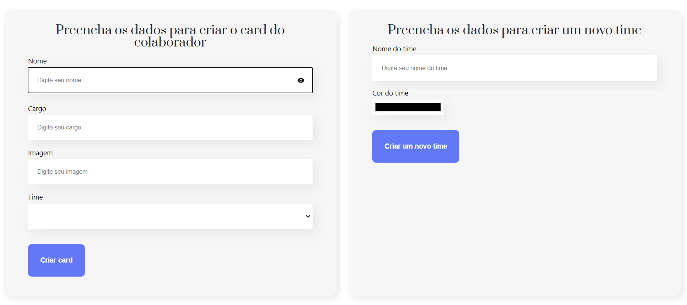
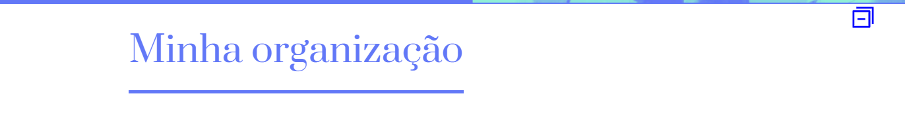
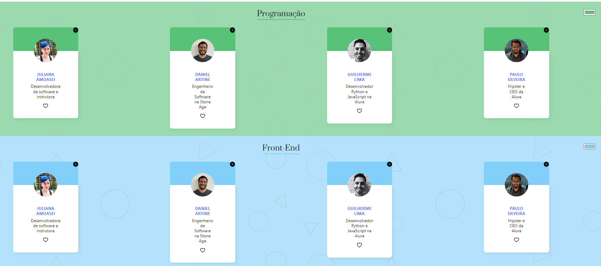
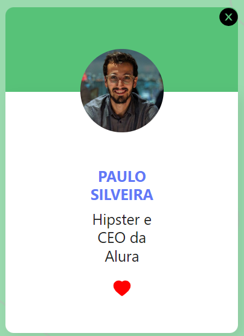
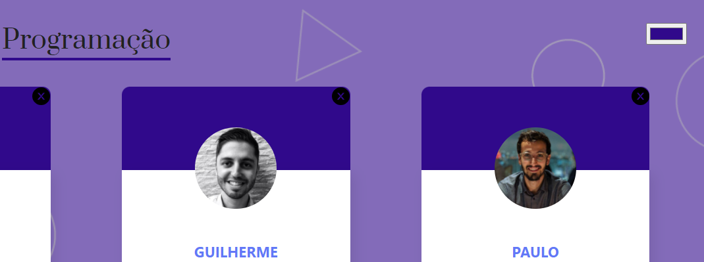

# Website created in React, using html, css and js.

## Available at: https://react-site-organo.vercel.app/

### Webapp created in Alura React's course.

Components with forms and different types of inputs, where is possible to create a 'colaborador' dinamicaly, create teams and select their color.

Button to hide/show forms:

Team and 'colaborador' components created dinamicaly, according to 'colaborador' team, submited on the form.

Delete and like icons. When you click on the 'x' icon, the 'colaborador' is deleted from the page.
When you click on the 'heart' icon, switch from red to empty heart.

Color button on the right, where you can change the team color.

